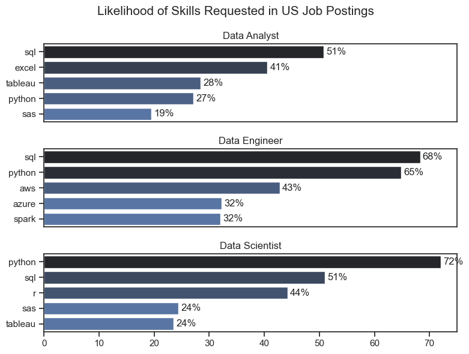

# The Analysis

## 1. What are the most demanded skills for the top 3 most popular data roles?

To find the most demanded skills for the top 3 most popular data roles. I filtered out those positions by which ones were the most popular, and got the top 5 skills for these top 3 roles. This query highlights the most popular job titles and their top skills, showing which skills I should pay attention to depending on the role I'm targenting

View my notebook with detailed steps here:
[2_Skills_count.ipynb](./2_Skills_count.ipynb)

## Visualize Data

```python
fig, ax = plt.subplots(len(job_titles), 1, sharex=True, figsize=(8, 6))

sns.set_theme(style='ticks')

for i, job_title in enumerate(job_titles):
    df_plot = df_skills_perc[df_skills_perc['job_title_short'] == job_title].head(5)
    sns.barplot(data=df_plot, x='skill_percentage', y='job_skills', ax=ax[i], hue= 'skill_count', palette='dark:b_r', legend=False)
    #Etiqueta las barras con su porcentaje
    [ax[i].bar_label(c, fmt='%.0f%%', padding=3) for c in ax[i].containers]
    ax[i].set_title(job_title)
    ax[i].set(xlabel='', ylabel='', xlim=(0, 75))
    # Quita los ticks si no es el último gráfico
    if i != len(job_titles) - 1:
        ax[i].tick_params(axis='x', which='both', bottom=False, top=False)

fig.suptitle('Likelihood of Skills Requested in US Job Postings', fontsize=15)
fig.tight_layout(h_pad=1.5)
plt.show()
```

### Results



### Insights

- SQL vs. Python Dominance: SQL is the most requested skill for Data Analysts (51%) and Data Engineers (68%), solidifying its role as the universal language for data. However, for Data Scientists, Python (72%) is the absolute requirement, outperforming SQL by more than 20 percentage points.
- Technical Specialization in Engineering: Data Engineers show a significantly higher demand for infrastructure and cloud computing skills, such as AWS (43%), Azure (32%), and Spark (32%). This contrasts with Data Analysts, whose profile is more oriented toward visualization and reporting tools like Excel (41%) and Tableau (28%).
- Python’s Versatility: Python stands out as the most versatile and balanced skill across all three roles. While its highest demand is in Data Science (72%) and Data Engineering (65%), it also appears in the Top 5 for Data Analytics (27%), suggesting that automation is gaining ground even in traditionally less technical roles.
